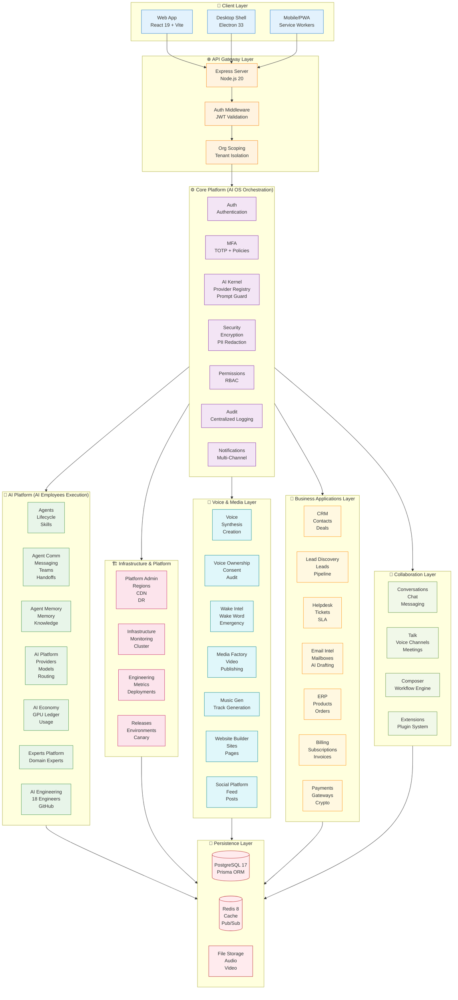

# WINDELS AI OS — Architecture Diagrams

**Version:** 4.0  
**Date:** 2026-08-07  

This document contains architecture diagrams in Mermaid format (renderable in GitHub) and ASCII format (for plain text).

See also:
- `docs/MODULE_ARCHITECTURE.md` — Full module specification
- `docs/MODULE_DEPENDENCY_MAP.md` — Dependency graph

---

## Diagram 1: Overall System Architecture

