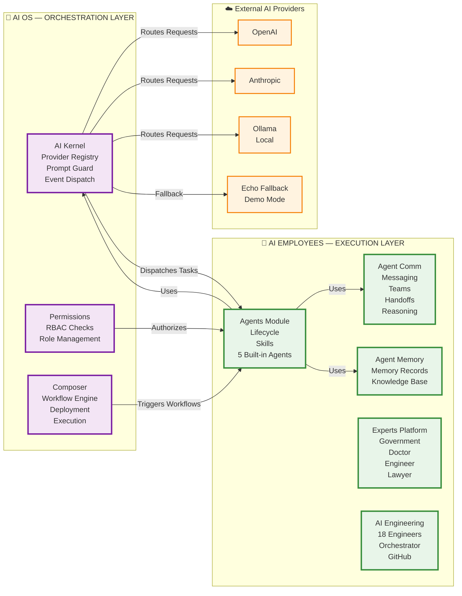

# WINDELS AI OS — Architecture Diagrams (Part 2)

## Diagram 2: AI OS vs AI Employees Separation

```mermaid
flowchart LR
    subgraph AI_OS["🤖 AI OS — ORCHESTRATION LAYER"]
        Kernel[AI Kernel<br/>Provider Registry<br/>Prompt Guard<br/>Event Dispatch]
        Permissions[Permissions<br/>RBAC Checks<br/>Role Management]
        Composer[Composer<br/>Workflow Engine<br/>Deployment<br/>Execution]
    end

    subgraph AI_EMPLOYEES["👷 AI EMPLOYEES — EXECUTION LAYER"]
        Agents[Agents Module<br/>Lifecycle<br/>Skills<br/>5 Built-in Agents]
        AgentComm[Agent Comm<br/>Messaging<br/>Teams<br/>Handoffs<br/>Reasoning]
        AgentMemory[Agent Memory<br/>Memory Records<br/>Knowledge Base]
        Experts[Experts Platform<br/>Government<br/>Doctor<br/>Engineer<br/>Lawyer]
        AIEng[AI Engineering<br/>18 Engineers<br/>Orchestrator<br/>GitHub]
    end

    subgraph EXTERNAL_AI["☁️ External AI Providers"]
        OpenAI[OpenAI]
        Anthropic[Anthropic]
        Ollama[Ollama<br/>Local]
        Echo[Echo Fallback<br/>Demo Mode]
    end

    Kernel -->|Routes Requests| OpenAI
    Kernel -->|Routes Requests| Anthropic
    Kernel -->|Routes Requests| Ollama
    Kernel -->|Fallback| Echo

    Kernel -->|Dispatches Tasks| Agents
    Permissions -->|Authorizes| Agents
    Composer -->|Triggers Workflows| Agents

    Agents -->|Uses| AgentComm
    Agents -->|Uses| AgentMemory
    Agents -->|Uses| Kernel

    classDef os fill:#f3e5f5,stroke:#7b1fa2,stroke-width:3px
    classDef employees fill:#e8f5e9,stroke:#388e3c,stroke-width:3px
    classDef external fill:#fff3e0,stroke:#f57c00,stroke-width:2px

    class Kernel,Permissions,Composer os
    class Agents,AgentComm,AgentMemory,Experts,AIEng employees
    class OpenAI,Anthropic,Ollama,Echo external
```
