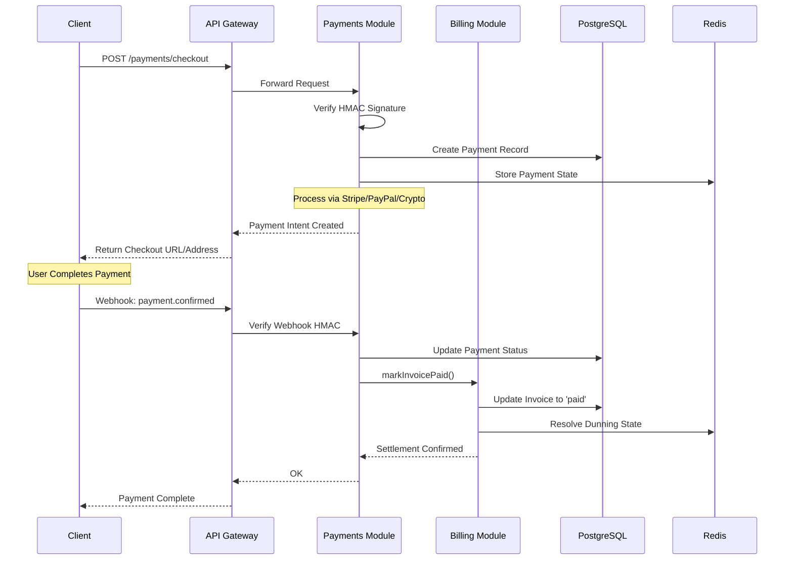

# WINDELS AI OS — Architecture Diagrams (Part 3)

## Diagram 3: Data Flow — Payment Processing

```mermaid
sequenceDiagram
    participant Client as Client
    participant Gateway as API Gateway
    participant Payments as Payments Module
    participant Billing as Billing Module
    participant DB as PostgreSQL
    participant Redis as Redis

    Client->>Gateway: POST /payments/checkout
    Gateway->>Payments: Forward Request
    Payments->>Payments: Verify HMAC Signature
    Payments->>DB: Create Payment Record
    Payments->>Redis: Store Payment State
    
    Note over Payments: Process via Stripe/PayPal/Crypto
    
    Payments-->>Gateway: Payment Intent Created
    Gateway-->>Client: Return Checkout URL/Address
    
    Note over Client: User Completes Payment
    
    Client->>Gateway: Webhook: payment.confirmed
    Gateway->>Payments: Verify Webhook HMAC
    Payments->>DB: Update Payment Status
    Payments->>Billing: markInvoicePaid()
    Billing->>DB: Update Invoice to 'paid'
    Billing->>Redis: Resolve Dunning State
    Billing-->>Payments: Settlement Confirmed
    Payments-->>Gateway: OK
    Gateway-->>Client: Payment Complete
```
